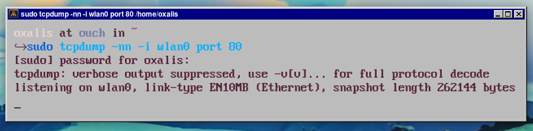
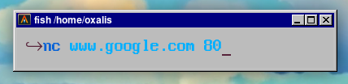
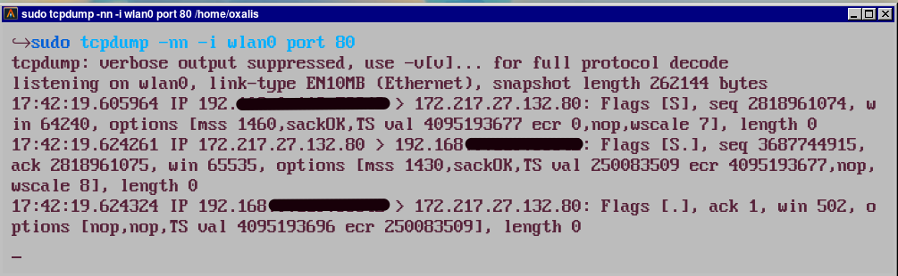

# INTERNET

 

> How did it work? I will use a story to explain it!

 

 
 
  - [👉跳到說明(Description)](#Description)

# FIRST OF ALL

 > http protocol: Application 應用層 HTTP protocol is based on TCP.     //  應用層面，主要解決如何封裝資料。

 > TCP protocol: Transport 傳輸層.                                      // 顧名思義，解決如何在網路中傳輸的問題。

 > ip protocol: Internet 網路層.                                        // 網路層面，功能同上。

 > TCP/IP 稱為網際網路協議套組，這兩大家族組成網路基礎架構。

 

 ### TCP/IP  

   TCP/IP Protocol Suite:  

 > 當多個協定同時工作時，類似計算機的堆棧，所以又稱(TCP/IP Protocol Stack)。  

 > 將資料應該如何封裝、定址、傳輸、路由以及在目的地如何接收，都加以標準化。 

 #### OSI (Open System Interconnection Model)

 

 

 通常人們認為OSI模型的最上面三層（應用層、表示層和會話層）在TCP/IP組中是一個應用層。
 > ip is also based on the network layer as a black box design.
 > So it is also reasonable as a layer.

 

  

 ## TCP (Transmission Control Protocol)

 1. 面向連接:  

    面向連接代表雙方在交換數據時必須先建立連結。
    > 舉例: A撥打電話給B，A要等B聽到後接起，確認是A後才能溝通。
    > Example:  A Dialing the phone to B, B should wait for B to hear, confirm that it is A to communicate.

 2. 基於字節流:  

    TCP交換數據格式是字節(byte)組成的有序字節流。  

    
用上面的故事做比喻: 

    ### 📖 故事說明(Description)

     賣家買家互相通電 &nbsp; => TCP/IP &ensp; 三次握手，建立連接(connection establishment)。 

     賣家打包 &nbsp; &ensp; &ensp; &ensp; &ensp; &nbsp; => 內核按照 &ensp; TCP protocol &ensp; 將無特殊格式的數據打包成 __報文段(segment)__ ， 

     賣家寄出 &nbsp; &ensp; &ensp; &ensp; &ensp; &nbsp; => 內核按照 &ensp; IP protocol &ensp; 將數據報文封包成 __數據報(IP Datagram)__ 。  

     物流中心 &nbsp; &ensp; &ensp; &ensp; &ensp; &nbsp; => __數據報(IP Datagram)__ &ensp; 經過路由器網路傳輸到伺服器。   

     買家收到 &nbsp; &ensp; &ensp; &ensp; &ensp; &nbsp; => 內核從 __數據報(IP Datagram)__ ，拆分出TCP的 __報文段(segment)__ 。   

     買家拆包 &nbsp; &ensp; &ensp; &ensp; &ensp; &nbsp; => 內核從 __報文段(segment)__ 還原成字節流(byte stream) ，再把數據(Data)給到應用層。  

    > __數據報(IP Datagram)__: &ensp; 為封包網絡中最小的單位。     

    

    __報文段(segment)__ 的結構: 

    
      

    ### TCP首部結構:

      - 端口號(Source Port and Destination Port): &ensp; 每個TCP報文段都有端口號，用於找發送端和接收端應用端進程。 

      - 序號(Sequence Number): &ensp; 將失序的數據從新排列，它位於TCP設置為數據部份的第一個字節的編號。 

      - 確認序號(Acknowledgment Number): &ensp; 接收方確認收到後所回覆的，用於核對接收的數據，下一次數據從那開始發。ack=1回傳ack+1。
     
      - 控制位(Control Bits):  
      

         - URG (Urgent Bit): &ensp; 值為1時，緊急指針生效。

         - ACK (Acknowledrment Bit): &ensp; 值為1時，確認序號生效。

         - PSH (Push Bit): &ensp; 接收方盡快把報文段交給應用層。

         - RST (Reset Bit): &ensp; 發送端遇到問題，想要重建連接。

         - SYN (SynchronizerBit): &ensp; 同步序號，用于發起一个連接。

         - FIN (Finish Bit): &ensp; 發送端請求斷開連接。

     - 窗口大小(Window): &ensp; 控制流量，起始於確認序號指明的值，值是接收端期望接收的字節。單位為字節，所以數組範圍（0~65565)。

     - 檢驗和(Checksum): &ensp; 用於驗證數據完整性，覆蓋整個首部和數據部份。發送端依算法算出檢驗和，接收端進行計算並檢驗。

     - 緊急指針(Urgent Pointer): &ensp; 當控制位URG=1時生效，得知有緊急數據要發送時，含有未發送字節到緊急字節之間數據的報文 都會將URG位設置為1。

       並不會加快數據交给應用層，只是盡快將緊急數據發出，加快緊急數據從内核缓冲放區到接收缓冲區中。

     - 有效數據部份(Data): &ensp; 非必需字段，比如在建立和關閉TCP連接的階段，雙方雙方交換的報文段只包含TCP首部。

     - 選項(options): &ensp; 這是可選字段，省略。

 3. 可靠性: 

   原理暫時省略，說明可靠性的原理: 

    (一). 合理的數據大小: TCP發送的數據會依據數據的情況調整報文大小。

    (二). 檢驗和: 發送端算出檢驗和存在TCP首部，接收端以同樣的方式計算並驗證，如不一致則說明報文段出現錯誤，就會直接丟棄。  

    (三). 序號與確認序列號: 對亂序的數據排列後發送給應用層，重複的直接丟棄。  

    (四). 超時重傳機制: 當TCP傳出報文段時，同時會啟動定時器，等帶接收端確認收到。如不能及時收到確認，將重新發送。  

    (五). 連接管理: 三次握手四次揮手，連接的可靠性是整體可靠性的前提。  

    (六). 流量控制: TCP雙方都有固定大小的緩衝區，流量控制原理是利用滑動窗口控制數度，避免緩衝溢出導致數據丟失。  

    (七). 擁塞控制: TCP利用慢啟動和擁塞避免算法實現擁塞控制。  

 > UDP (User Datagram Protocol)和 tcp 正是相差在上面第三四點，UDP適合用在一些可以接收少數丟包的應用上。

 ## HTTP(HyperText Transfer Protocol)

  > http 最初的目的是提供一種發布和接收HTML頁面的方法。他基於TCP所以他的優點跟瓶頸也都是TCP的特性。

   - 協議開銷大: &ensp; http/1.0，header首部攜帶的內容過大，增加運輸成本，而且每次header都沒什麼變化。

   - SPY協議: &ensp; google2009研發的降低延遲，壓縮首部header檔案，http/2.0最大的目標是一個網站只用一個連接。

   - QUIC協議: &ensp; google2012基於UTP的傳輸協定。吸取了TCP的精華，和UTP的優點推出了http/3.0。

 ## HTTP TCP Actual (實做)

     用tcpdump監控80端口。

   

    用netCat連接google

   
   
    建立連接: 

   

 ## SOCKET
 
 > socket就是一個api提供一個通訊的端點。